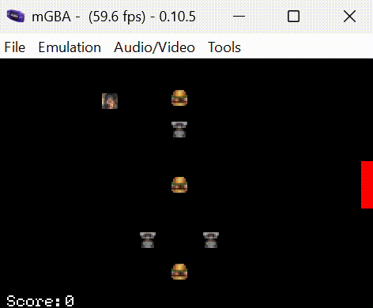

# Five Nights at The Krusty Krab

It is nighttime and you broke into the Krusty Krab to steal krabby patties so you can reverse engineer the secret formula. Only Squidward is on night shift and isn't messing around. Don't get caught.

## Game Mechanics

This game is a weird parody of World's Hardest Game. The goal is to collect all 3 Krabby Patties and reach the exit without getting caught by Squidward. If you get caught, you immediately lose.



## Implementation Details

This program is written in C and meant to be run on a Game Boy Advance (GBA) emulator. Since the GBA doesn't have an operating system, the GBA devices (screen, buttons, DMA controller, etc.) are controlled via memory-mapped IO. Since the GBA is a resource-limited hardware device and is a very slow computer, several tricks were used to optimize the performance of this program including Direct Memory Access (DMA), integer math instead of floating point math, and so forth.

## Usage

To setup this game, clone the repository.
```
https://github.com/skn47/five_nights_at_the_krusty_krab.git
```

### Linux/macOS
Enter a terminal, go to this directory, then run this script to open the Docker container to use mGBA natively.
```
./cs2110docker-gba.sh
```
Compile the program.
```
make mgba
```
Open mGBA > Load ROM > `Game.elf`.

### Windows
Enter a terminal, go to this directory, then run this script to open the Docker container to use mGBA natively.
```
cs2110docker-gba.bat
```
Compile the program.
```
make mgba
```
Open mGBA > Load ROM > `Game.gba`.

## Controls
* Move left: left arrow
* Move right: right arrow
* Move down: down arrow
* Move up: up arrow

